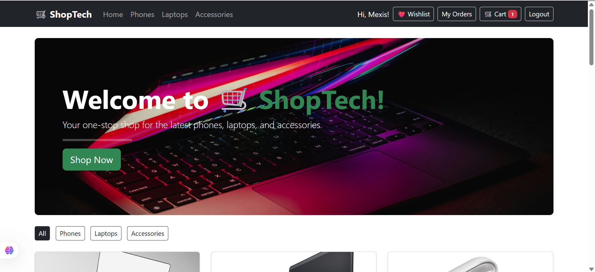
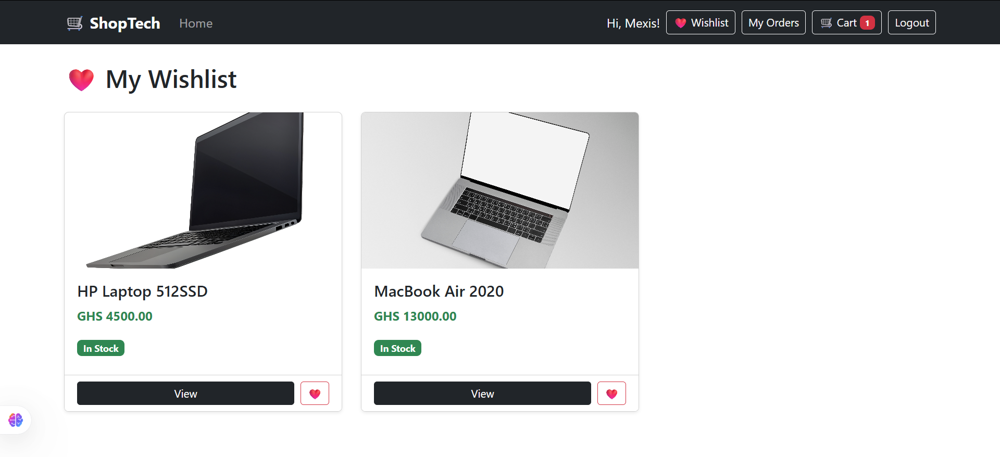
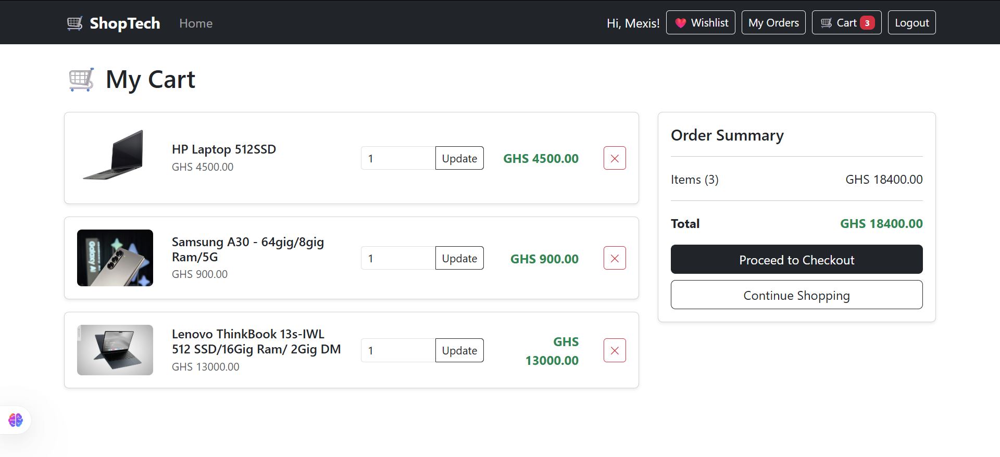
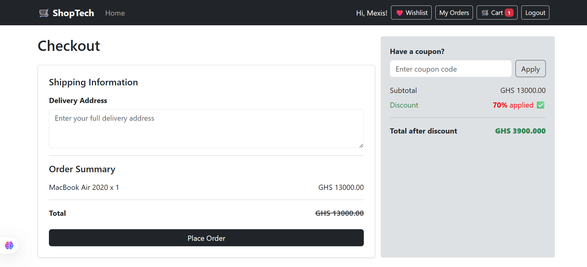
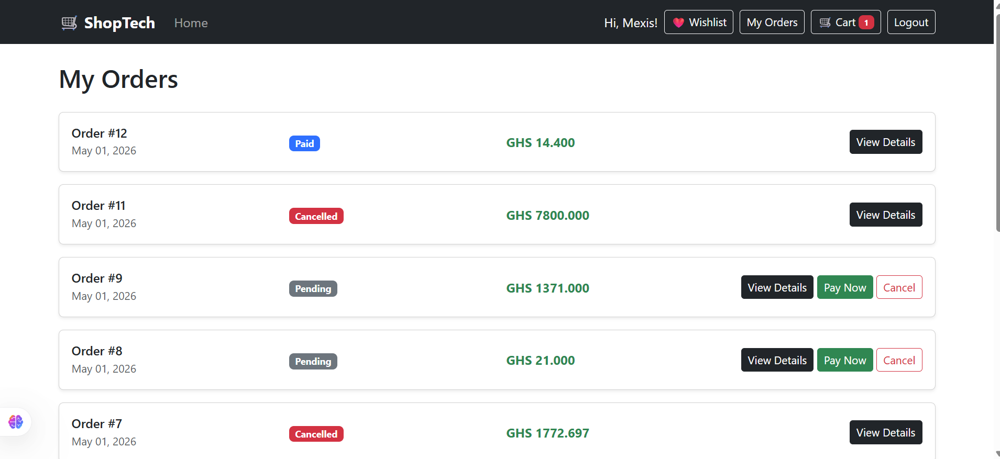
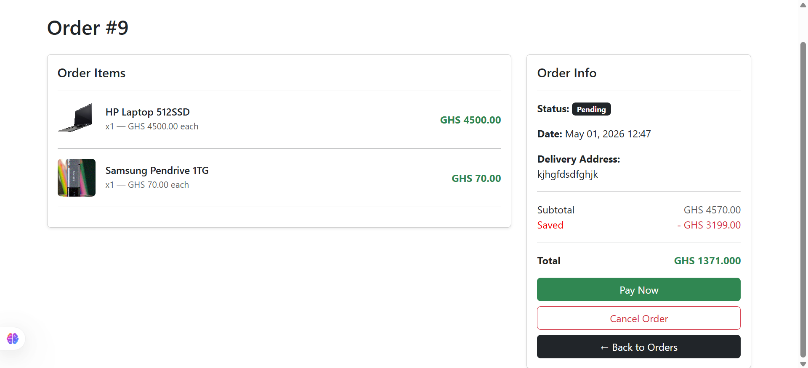
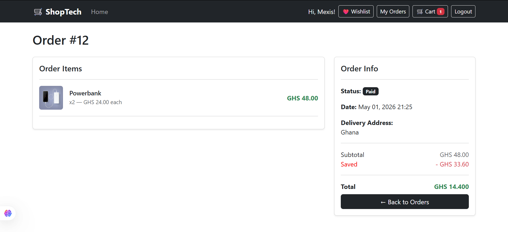
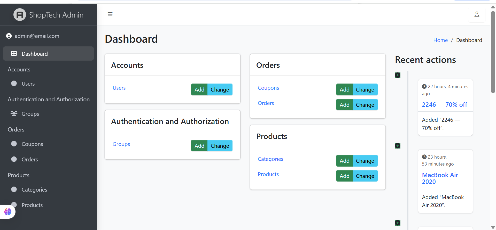
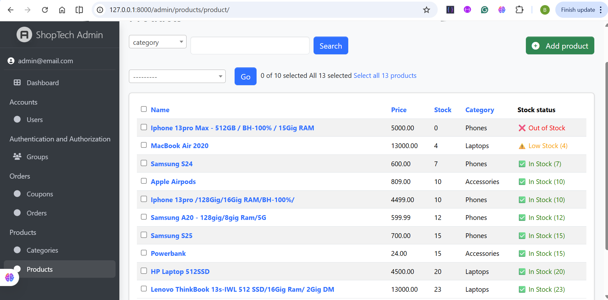

# Django ShopTech 🛒


A full-stack e-commerce web application for phones, laptops, and accessories built with Django. Features live Paystack payment processing, product reviews and ratings, wishlist, coupon/discount codes, real-time order tracking, persistent image storage via Cloudinary, and a customized Jazzmin admin panel. Deployed on Render with Supabase PostgreSQL.

> **Live Demo:** [https://django-shoptech.onrender.com](https://django-shoptech.onrender.com)

---

## Screenshots

> **Homepage — Product Listing**



> **Wishlist**


> **Shopping Cart**


> **Checkout with Coupon**


> **Order History & Details**




> **Django Admin Panel**



---

## Features

### Customers
- Browse and search products across multiple categories
- View product details with average star ratings and customer reviews
- Add products to shopping cart and manage quantities
- Add products to wishlist for later
- Apply coupon/discount codes at checkout
- Secure checkout with delivery address
- **Live payment processing via Paystack API** (cards, mobile money, bank transfers)
- Real-time order tracking (Pending → Paid → Processing → Shipped → Delivered)
- Cancel pending orders
- Write product reviews with star ratings (one review per user per product)
- User registration and secure login

### Admin
- Full product management — add, edit, delete products with image uploads
- **Persistent image storage via Cloudinary** — images never disappear on redeploy
- **Low stock warning system** — color coded stock status (✅ In Stock / ⚠️ Low Stock / ❌ Out of Stock)
- Manage product categories with auto-generated slugs
- View and manage all customer orders with inline order items
- Update order status directly from the orders list
- Create and manage coupon/discount codes with expiry dates
- Manage user accounts
- Customized admin panel powered by **django-jazzmin**

---

## Tech Stack

| Layer | Technology |
|---|---|
| Language | Python 3.13 |
| Framework | Django 6.0 |
| Admin UI | django-jazzmin |
| Database (local) | SQLite |
| Database (production) | PostgreSQL (Supabase) |
| ORM | Django ORM |
| Migrations | Django Migrations |
| Payments | Paystack API |
| Image Storage | Cloudinary |
| Authentication | Django Built-in Auth + Custom User Model |
| Forms | Django Forms |
| Templating | Django Templates |
| Frontend | HTML, CSS, Bootstrap 5 |
| Image Processing | Pillow |
| Static Files | WhiteNoise |
| Deployment | Render |
| Server | Gunicorn |

---

## Getting Started

### Prerequisites
- Python 3.10+
- Git
- Paystack account (for payment keys)
- Cloudinary account (for image storage)

### Installation

```bash
# Clone the repository
git clone https://github.com/BenjaminTutu/django-shoptech.git
cd django-shoptech

# Create and activate virtual environment
python -m venv .venv

# Windows
.venv\Scripts\activate

# Mac/Linux
source .venv/bin/activate

# Install dependencies
pip install -r requirements.txt
```

### Environment Variables

Create a `.env` file in the root directory:

```
SECRET_KEY=your-secret-key-here
DEBUG=True
DATABASE_URL=sqlite:///db.sqlite3
PAYSTACK_SECRET_KEY=sk_test_xxxxxxxxxxxx
PAYSTACK_PUBLIC_KEY=pk_test_xxxxxxxxxxxx
CLOUDINARY_CLOUD_NAME=your-cloud-name
CLOUDINARY_API_KEY=your-api-key
CLOUDINARY_API_SECRET=your-api-secret
```

### Run Locally

```bash
python manage.py migrate
python manage.py createsuperuser
python manage.py runserver
```

Visit `http://127.0.0.1:8000`
Admin panel at `http://127.0.0.1:8000/admin`

---

## Testing Payments Locally

Use Paystack test credentials:

| Field | Value |
|---|---|
| Card Number | `4084 0840 8408 4081` |
| Expiry | Any future date |
| CVV | Any 3 digits |
| PIN | `0000` |

---

## Deployment

This app is deployed on **Render** with **Supabase PostgreSQL** as the production database and **Cloudinary** for persistent media storage.

### Environment Variables on Render

| Key | Description |
|---|---|
| `SECRET_KEY` | Django secret key |
| `DATABASE_URL` | Supabase PostgreSQL connection string |
| `DEBUG` | Set to `False` in production |
| `PAYSTACK_SECRET_KEY` | Paystack secret key |
| `PAYSTACK_PUBLIC_KEY` | Paystack public key |
| `CLOUDINARY_CLOUD_NAME` | Cloudinary cloud name |
| `CLOUDINARY_API_KEY` | Cloudinary API key |
| `CLOUDINARY_API_SECRET` | Cloudinary API secret |
| `DJANGO_SUPERUSER_USERNAME` | Admin username |
| `DJANGO_SUPERUSER_EMAIL` | Admin email |
| `DJANGO_SUPERUSER_PASSWORD` | Admin password |

### Start Command

```
python manage.py migrate && python manage.py collectstatic --noinput && python manage.py createsuperuser --noinput 2>/dev/null; gunicorn ShopTech.wsgi
```

---

## Order Status Flow

```
Pending → Paid → Processing → Shipped → Delivered
                                      ↘ Cancelled
```

---

## Key Django Features Used

- **Custom User Model** — extended Django's built-in User with phone, address and role
- **Django ORM** — complex queries and relationships without raw SQL
- **Built-in Auth** — secure authentication out of the box
- **Jazzmin Admin Panel** — customized, modern admin interface
- **Slug URLs** — SEO-friendly URLs auto-generated from product names
- **CSRF Protection** — built-in security on all forms
- **Template Inheritance** — base template extended across all pages
- **Django Sessions** — coupon code management across requests

---

## Author

**Benjamin Tutu** — Python Backend Developer, Ghana

- GitHub: [@BenjaminTutu](https://github.com/BenjaminTutu)
- Live Demo: [https://django-shoptech.onrender.com](https://django-shoptech.onrender.com)
- Open to: Part-time backend roles, freelance projects, and collaborations

---

## License

This project is licensed under the MIT License.